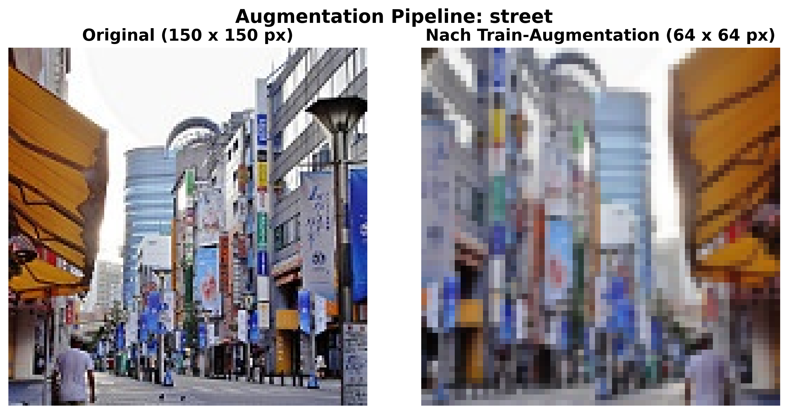

# CNN Hyperparameter Tuning & Model Evaluation — Intel Image Classification


I built a convolutional neural network from scratch for natural-scene classification. I then improved it by testing **11 hypotheses** one at a time and ran a **600-run hyperparameter sweep**. The final model is a combination of the techniques that worked, and I evaluated it with cross-validation, a check against the winner's curse and training with several random seeds.

> **Result:** validation accuracy went from **84.89 %** for the plain SGD baseline to **89.74 %** for the final model (+4.85 pp). Test accuracy is **89.20 % ± 0.46 %** (mean ± SD over 3 seeds, 3,000 held-out images).

Deep Learning module, BSc Data Science, [FHNW](https://www.fhnw.ch/) (University of Applied Sciences and Arts Northwestern Switzerland).

---

## Contents

- [Highlights](#highlights)
- [Results](#results)
- [Approach](#approach)
- [Final Model](#final-model)
- [Key Learnings](#key-learnings)
- [Experiment Tracking](#experiment-tracking)
- [Getting Started](#getting-started)
- [Repository Structure](#repository-structure)
- [References](#references)
- [Author](#author)

---

## Highlights

- **Hypothesis-driven experimentation.** Every experiment has the same three parts: a hypothesis grounded in theory, a controlled experiment that changes one thing at a time, and an analysis that checks whether the hypothesis held.
- **Rigorous evaluation:**
  - 5-fold cross-validation reporting the standard error and a t-based 95 % confidence interval, not just a standard deviation.
  - A check against the winner's curse before the best sweep run was accepted.
  - Multi-seed retraining to measure how much the result varies between training runs.
- **No data leakage.** The normalisation statistics come from the training split only. The test set was used only to evaluate the final model.
- **Sanity checks before training.** The model was first trained on a single batch until the loss approached zero, which shows that the model and training loop work.
- **Full MLOps tracking.** Every run, sweep and report is logged to Weights & Biases, and 16 public W&B reports document the experiments.
- **Long-running sweep outside the notebook.** The sweep is a standalone script ([`src/sweep.py`](src/sweep.py)) that ran for about 48 h on Apple Silicon (MPS). It used Hyperband early stopping, and it keeps running if the notebook kernel restarts.

## Results

### Hypothesis overview

Each hypothesis is compared with the same fixed baseline: SGD without momentum, no regularisation, no BatchNorm, 50 epochs. All values are best validation accuracy.

| #         | Technique                              | Val Acc                                | Δ vs. Baseline | In final model    |
| --------- | -------------------------------------- | -------------------------------------- | -------------- | ----------------- |
| Baseline  | 3-block CNN, SGD, no regularisation    | 84.89 %                                | —              | —                 |
| H1        | Depth: 4 conv blocks                   | 85.70 %                                | +0.81 pp       | ✅                |
| H2        | Width: 2× filters                      | 86.32 %                                | +1.43 pp       | ✅ (4× via sweep) |
| H3        | Kernel size 5×5                        | 84.53 %                                | −0.36 pp       | ❌                |
| H4        | AvgPool instead of MaxPool             | 83.18 %                                | −1.71 pp       | ❌                |
| H5        | Dropout (p = 0.5)                      | 85.92 %                                | +1.03 pp       | ✅                |
| H6        | Stronger data augmentation             | 85.43 %                                | +0.54 pp       | ✅                |
| H7        | Weight decay (5e-4)                    | 85.96 %                                | +1.07 pp       | ✅                |
| H8        | BatchNorm (+ batch-size re-tuning)     | 87.60 %                                | +2.71 pp       | ✅                |
| H9        | Weight initialisation                  | —                                      | —              | dropped¹          |
| H10       | Adam optimizer (lr = 5e-4)             | 87.39 %                                | +2.50 pp       | ✅                |
| H11       | Transfer learning (ResNet18 fine-tune) | ~91.0 %                                | ~+6.1 pp       | ❌²               |
| **Final** | **H1 + H2 + H5 + H6 + H7 + H8 + H10**  | **89.74 %** (val) / **89.20 %** (test) | **+4.85 pp**   | —                 |

¹ PyTorch already uses Kaiming-uniform initialisation by default, so comparing it against Xavier was not expected to show a measurable difference.
² The module required the final model to be trained from scratch, without pre-trained weights. ResNet18 fine-tuning was therefore evaluated as a hypothesis only. It scored highest on its own but also had the largest generalisation gap.

### Stage 1: baseline statistics (5-fold CV)

| Metric                        | Value              |
| ----------------------------- | ------------------ |
| Best learning rate (SGD)      | 0.05               |
| Best batch size               | 64                 |
| Mean validation accuracy      | 86.75 %            |
| Standard error (SD/√K)        | ± 0.20 pp          |
| 95 % CI (t-distribution, K=5) | [86.19 %, 87.32 %] |

### Final model: per-class test performance (seed 42)

| Class     | Precision | Recall | F1   |
| --------- | --------- | ------ | ---- |
| buildings | 0.91      | 0.86   | 0.89 |
| forest    | 0.97      | 0.98   | 0.98 |
| glacier   | 0.89      | 0.82   | 0.85 |
| mountain  | 0.83      | 0.88   | 0.85 |
| sea       | 0.90      | 0.93   | 0.91 |
| street    | 0.90      | 0.92   | 0.91 |

`forest` is almost solved. The model mostly confuses `glacier` and `mountain`, which is expected because the two classes look alike (snow, rock, sky).

## Approach

### Dataset

[Intel Image Classification](https://huggingface.co/datasets/sfarrukhm/intel-image-classification) (Hugging Face) contains natural scenes in **6 balanced classes**: buildings, forest, glacier, mountain, sea and street.

| Split      | Images |
| ---------- | ------ |
| Train      | 11,227 |
| Validation | 2,807  |
| Test       | 3,000  |

The original images are 150 × 150 px. I downscaled them to **64 × 64** so that many model variants could be trained on a laptop in reasonable time.



### Stage 1: baseline model

1. **Exploratory data analysis:** class balance, image sizes, and pixel distributions per channel and class.
2. **Preprocessing:** a train/validation split before computing per-channel mean and std (to avoid leakage), and `RandomResizedCrop` plus `HorizontalFlip` for augmentation.
3. **Baseline CNN:** 3 × (Conv → ReLU → MaxPool) followed by 2 fully connected layers, 548,774 parameters.
4. **Single-batch overfitting test** to validate the training loop.
5. **Manual grid search over learning rate and batch size**. Automated search was not allowed at this stage.
6. **5-fold cross-validation** to estimate the statistical error of the metric.

### Stage 2: hypothesis testing

For the 11 hypotheses in the table above, I compared each change against a single fixed `phase2-baseline` run under identical conditions (50 epochs, same data loaders, same seed).

### Final model: sweep, robustness check, multi-seed retraining

1. **Architecture decisions fixed from the hypotheses:** 4 conv blocks, BatchNorm, 3×3 kernels, MaxPool, Adam, dropout in the classifier.
2. **W&B random sweep (600 runs)** over the continuous hyperparameters: learning rate, weight decay, dropout, width, FC size, batch size and augmentation strength. Hyperband stopped weak runs early.
3. **Winner's-curse check.** The top run (90.06 %) is only **0.36 pp** above the median of the top 10. That puts it on a stable plateau rather than making it a lucky outlier.
4. **Sensitivity analysis:**
   - `batch_size=32` and `base_filters=64` cluster clearly among the top runs.
   - Learning rate, weight decay and colour jitter hardly matter within the swept range.
5. **Retraining with 3 seeds** (42, 7, 123) to report mean ± SD on the held-out test set.

## Final Model

```
Input 3×64×64
 ├─ [Conv3×3 → BatchNorm → ReLU → MaxPool2]  ×4   channels: 64 → 128 → 256 → 512
 ├─ Flatten (512×4×4 = 8192)
 ├─ Linear(8192 → 256) → ReLU → Dropout(0.18)
 └─ Linear(256 → 6)
```

The model has about 3.65 M parameters. It was trained for 50 epochs with Adam (lr ≈ 2.3e-4, weight decay ≈ 1.9e-4) and batch size 32. Augmentation: `RandomResizedCrop`, `HorizontalFlip`, `ColorJitter(0.17)`.

## Key Learnings

- **BatchNorm and Adam together give more than either one alone.** Each adds about 2.5 pp on its own, through different mechanisms (normalising activations vs. adapting the learning rate per parameter). Combined with more width, they explain most of the final gain.
- **Width only pays off with regularisation.** Doubling the filters without regularisation mostly widened the generalisation gap. With BatchNorm, dropout and augmentation in place, the sweep chose 4× width.
- **BatchNorm needs the batch size re-tuned.** Batch size 64 made training collapse with BN, while smaller batches were stable.
- **Dropout, weight decay and augmentation complement each other.** Each reduced the train/validation loss gap from about 0.20 to about 0.05.
- **Feature extraction with a frozen ImageNet backbone did worse than the baseline** (~79 %) at 64 × 64 px. Only full fine-tuning bridged the gap between ImageNet and this dataset.
- **With many runs, the best one is biased upward.** Checking the top-1 result against the top-10 distribution and retraining with several seeds gives a more honest performance estimate.

## Experiment Tracking

All experiments are publicly available on Weights & Biases:

| Stage       | Reports |
| ----------- | ------- |
| Baseline    | [Base model](https://wandb.ai/mannaluca02-fachhochschule-nordwestschweiz-fhnw/del-mini-challenge/reports/DEL-Basis-modell-Report--VmlldzoxNjU5ODYwMQ) · [Learning rate](https://wandb.ai/mannaluca02-fachhochschule-nordwestschweiz-fhnw/del-mini-challenge/reports/DEL-Learning-Rate-Tuning-Report--VmlldzoxNjYwMTUxMA) · [Batch size](https://wandb.ai/mannaluca02-fachhochschule-nordwestschweiz-fhnw/del-mini-challenge/reports/DEL-Batch-size-Tuning-Report--VmlldzoxNjYwMTc1Ng) · [Cross-validation](https://wandb.ai/mannaluca02-fachhochschule-nordwestschweiz-fhnw/del-mini-challenge/reports/DEL-Cross-validation-Report--VmlldzoxNjYwMTgzNg) |
| Hypotheses  | [H1](https://wandb.ai/mannaluca02-fachhochschule-nordwestschweiz-fhnw/del-mini-challenge/reports/DEL-H1-Modelltiefe--VmlldzoxNjYxNDYzMQ) · [H2](https://wandb.ai/mannaluca02-fachhochschule-nordwestschweiz-fhnw/del-mini-challenge/reports/DEL-H2-Modellbreite--VmlldzoxNjYxNTY4Nw) · [H3](https://wandb.ai/mannaluca02-fachhochschule-nordwestschweiz-fhnw/del-mini-challenge/reports/DEL-H3-Kernal-Size--VmlldzoxNjYyNDkzNg) · [H4](https://wandb.ai/mannaluca02-fachhochschule-nordwestschweiz-fhnw/del-mini-challenge/reports/DEL-H4-Avg-Pooling--VmlldzoxNjYyNjEwNw) · [H5](https://wandb.ai/mannaluca02-fachhochschule-nordwestschweiz-fhnw/del-mini-challenge/reports/DEL-H5-Dropout--VmlldzoxNjYzOTE2OA) · [H6](https://wandb.ai/mannaluca02-fachhochschule-nordwestschweiz-fhnw/del-mini-challenge/reports/DEL-H6-Strong-Augmentation--VmlldzoxNjY0MTMxMg) · [H7](https://wandb.ai/mannaluca02-fachhochschule-nordwestschweiz-fhnw/del-mini-challenge/reports/DEL-H7-Weight-Decay--VmlldzoxNjY0MTYwMw) · [H8](https://wandb.ai/mannaluca02-fachhochschule-nordwestschweiz-fhnw/del-mini-challenge/reports/DEL-H8-Batch-Norm--VmlldzoxNjY1MzgyOQ) · [H10](https://wandb.ai/mannaluca02-fachhochschule-nordwestschweiz-fhnw/del-mini-challenge/reports/DEL-H10-Adam-Optimizer--VmlldzoxNjY1ODIzMA) · [H11](https://wandb.ai/mannaluca02-fachhochschule-nordwestschweiz-fhnw/del-mini-challenge/reports/DEL-H10-Transfer-Learning--VmlldzoxNjY1ODYzMA) |
| Final model | [Sweep (600 runs)](https://wandb.ai/mannaluca02-fachhochschule-nordwestschweiz-fhnw/del-mini-challenge/sweeps/oeiyw1i9) · [Final model report](https://wandb.ai/mannaluca02-fachhochschule-nordwestschweiz-fhnw/del-mini-challenge/reports/Final-Model--VmlldzoxNzA1OTM2Ng) |

## Getting Started

### Prerequisites

- Python 3.13
- A free [Weights & Biases](https://wandb.ai/) account for logging
- Optional: a GPU (CUDA) or Apple Silicon (MPS). The code picks the device automatically.

### Installation

```bash
git clone https://github.com/mannaluca02/cnn-hyperparameter-tuning.git
cd cnn-hyperparameter-tuning
python3 -m venv .venv
source .venv/bin/activate
pip install -r requirements.txt
wandb login
```

The dataset is downloaded from Hugging Face on first run and cached in `data/`.

### Run

```bash
# Main analysis (EDA, baseline, hypotheses H1–H11, final model)
jupyter lab src/00_first_model.ipynb

# Hyperparameter sweep for the final model
cd src
python sweep.py --test   # quick smoke test: 1 run, 3 epochs
python sweep.py          # full sweep (600 runs)
```

> **Note:** The notebook's explanations are in **German**, and the code and comments are in English. The executed notebook, with all outputs, renders directly on GitHub or on [nbviewer](https://nbviewer.org/github/mannaluca02/cnn-hyperparameter-tuning/blob/main/src/00_first_model.ipynb).

## Repository Structure

```
.
├── src/
│   ├── 00_first_model.ipynb   # Main notebook: EDA → baseline → H1–H11 → final model
│   ├── 00_first_model.qmd     # Quarto version of the notebook
│   ├── sweep.py               # Standalone W&B sweep for the final model
│   └── plots/                 # Architecture diagrams and figures
├── requirements.txt
├── LICENSE
└── README.md
```

## Tech Stack

**Modelling:** PyTorch, torchvision · **Data:** Hugging Face `datasets`, NumPy, pandas · **Evaluation:** scikit-learn · **Visualisation:** Matplotlib, seaborn · **Experiment tracking:** Weights & Biases (runs, sweeps, reports)

## References

- Bayle, P., Bayle, A., Janson, L. & Mackey, L. (2020). *Cross-validation Confidence Intervals for Test Error*. NeurIPS 33. [arXiv:2007.12671](https://arxiv.org/abs/2007.12671)
- Cawley, G. C. & Talbot, N. L. C. (2010). *On Over-fitting in Model Selection and Subsequent Selection Bias in Performance Evaluation*. JMLR 11, 2079–2107. [Link](https://www.jmlr.org/papers/v11/cawley10a.html)
- Marandon, A., Rebafka, T., Soret, P. & Verzelen, N. (2024). *A Flexible Defense Against the Winner's Curse*. [arXiv:2411.18569](https://arxiv.org/abs/2411.18569)

## Author

**Luca Manna**, BSc Data Science student at FHNW

[Portfolio](https://lucamanna.ch) · [LinkedIn](https://www.linkedin.com/in/luca-manna-ch) · [GitHub](https://github.com/mannaluca02)

## License

This project is licensed under the [MIT License](LICENSE).
